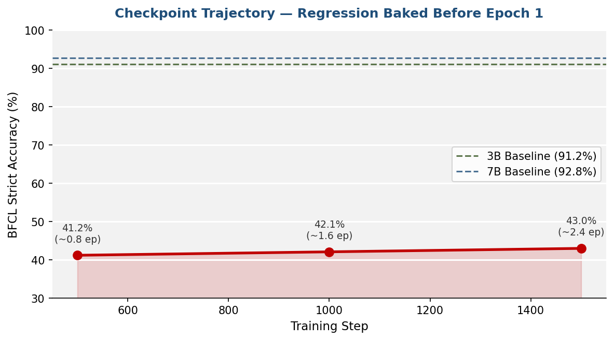
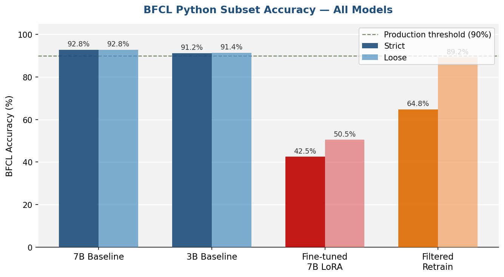
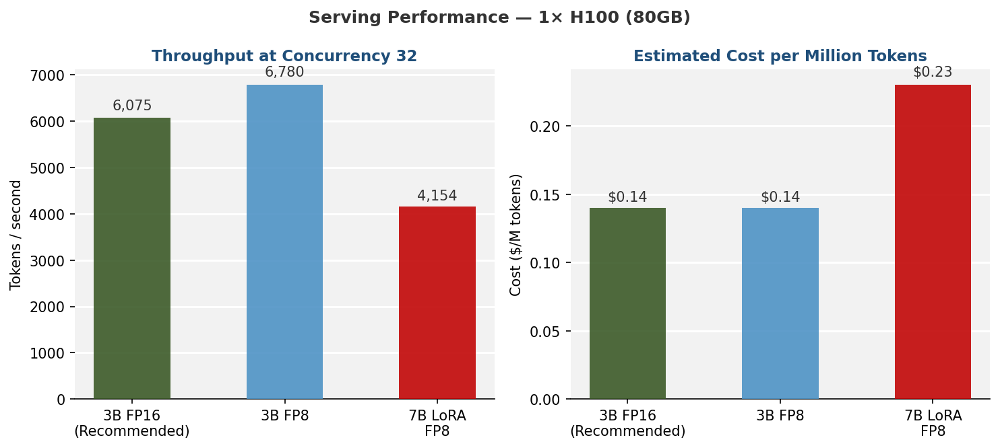

# LLM Fine-Tuning Audit — Tool-Calling PoC

> **Independent technical audit of a fine-tuned LLM for function calling in a FinTech production context.**  
> Covers regression decomposition, evaluation methodology critique, inference stack risk assessment, and production recommendations.

---

## The Problem

A FinTech team fine-tuned **Qwen-2.5-7B-Instruct** on the [ToolACE dataset](https://huggingface.co/datasets/Team-ACE/ToolACE) for function calling, deployed on a single H100, and evaluated on the [BFCL Python subset](https://gorilla.cs.berkeley.edu/leaderboard.html).

The headline result: **−50pp BFCL regression after fine-tuning** (92.8% → 42.5%).

The question: *Is this a real finding, or a methodology artifact?*

---

## What This Audit Does

```
audit/
├── bfcl_regression_analysis.py   # Regression decomposition: real vs artifact
├── inference_stack_review.py     # VRAM headroom, OOM risk, latency validity

scripts/
└── visualise_results.py          # Reproduces all charts from redacted results

results/
├── eval_results_redacted.json    # Real numbers, client identity removed
└── figures/                      # Generated charts
```

---

## Key Findings

### 1 — The 50pp Regression Is ~84% Real

| Component | Magnitude | Nature |
|---|---|---|
| Genuine behavioral regression | **42pp** | Model learned ToolACE's refusal-heavy distribution |
| Scorer artifact (strict name matching) | **8pp** | Fine-tune adopted module prefixes; base model doesn't |
| **Total** | **50pp** | |

The strict-vs-loose gap on the fine-tuned model is 8pp. The baselines show a 0pp gap. The prefix-dropping is a real behavioral change from ToolACE training — not a scorer quirk. But it only affects naming conventions, not parameter extraction.

---

### 2 — The Regression Baked In Before Epoch 1

Checkpoint evaluation at step 500 (~0.8 epochs) scored **41.2%** — within noise of the final 43.0%. Training duration is not the problem. The ToolACE data distribution is.



---

### 3 — A 5.2% Data Filter Recovered 22pp

Removing 537 training examples where the assistant refused to call or requested clarification:

| Model | Strict | Loose |
|---|---|---|
| Fine-tuned 7B (original) | 42.5% | 50.5% |
| Filtered retrain (1 epoch, LR 5e-5) | **64.8%** | **89.2%** |
| 7B Baseline | 92.8% | 92.8% |

The entire remaining gap at 89.2% loose is module-prefix naming convention. If the client's production APIs use flat names, the fine-tuned model is within **3.6pp** of the 7B baseline.

> **Caveat:** Data filter, epoch count, and LR were changed simultaneously. No clean ablation exists. The step-500 result rules out training duration as the driver — the data filter is doing the work.



---

### 4 — Production Recommendation: Ship the 3B Baseline

The 3B baseline is Pareto-optimal on every measured dimension:

| Model | BFCL Strict | Throughput | TTFT p99 | Cost/M tokens |
|---|---|---|---|---|
| **3B Baseline FP16** ✅ | **91.2%** | **6,075 tok/s** | **78.7ms** | **$0.14** |
| 3B Baseline FP8 | 91.0% | 6,780 tok/s | ⚠ 142.9ms* | $0.14 |
| Fine-tuned 7B FP8 | 42.5% | 4,154 tok/s | 87.0ms | $0.23 |

*3B FP8 TTFT spike (142.9ms vs 78.7ms on FP16) is unexplained — likely a CUDA graph or quantization kernel issue at this model size. Do not deploy FP8 3B for latency-sensitive workloads until diagnosed.



---

### 5 — The TTFT Numbers Are Optimistic

The benchmark measured 87ms p99 TTFT under steady-state, homogeneous load with a warm KV cache. Three reasons this is optimistic for production:

- **Prompt homogeneity** — 3 fixed templates = near-perfect RadixAttention prefix reuse. Real production prompts will have lower cache hit rates.
- **No cold start measurement** — first request after server restart or idle eviction is uncharacterised.
- **Fixed max_tokens=256** — understates TPOT p99 for longer outputs.

**Production estimate: 130–220ms p99 TTFT** under realistic prompt variance.

---

### 6 — VRAM Headroom at Concurrency 32

With `mem_fraction_static=0.90` on an 80GB H100 serving the FP8 7B (8.2GB weights):

| Component | Estimate |
|---|---|
| KV cache allocated | ~57.6 GB |
| CUDA overhead / headroom | ~6–8 GB |
| OOM risk at concurrency 32 | **LOW** (cache exhaustion risk is MEDIUM under burst) |

**Recommendation:** Set `mem_fraction_static=0.85` for production. Trades ~7% throughput for meaningful fragmentation headroom. Add KV cache utilisation monitoring before go-live.

---

## The Framing That Works

> *"The brief asked for the best model for the workload. The experiment told us what that is."*

Shipping a fine-tuned model that performs at 43% when a baseline delivers 91% is a failure of engineering judgment, not a success of process compliance. The correct workflow is: **establish baseline → measure gap → fine-tune to close the gap.** Step 1 revealed there is no gap to close on the current benchmark.

The right next step is to collect 2 weeks of production traffic, build a held-out eval set from actual client API queries, and only fine-tune if a gap emerges.

---

## Run It

```bash
# 1. Scaffold the project (PowerShell)
.\setup.ps1

# 2. Install dependencies
pip install -r requirements.txt

# 3. Run regression analysis
python audit/bfcl_regression_analysis.py

# 4. Run inference stack review
python audit/inference_stack_review.py

# 5. Generate charts
python scripts/visualise_results.py
```

---

## Skills Demonstrated

| Area | Detail |
|---|---|
| LLM evaluation methodology | BFCL AST-matching, strict vs loose scoring, scorer artifact identification |
| Fine-tuning analysis | LoRA training dynamics, overfitting diagnosis, data distribution effects |
| Inference stack review | SGLang, FP8 quantization, RadixAttention KV reuse, VRAM budgeting |
| Production risk assessment | TTFT measurement validity, cold start, KV cache exhaustion under burst load |
| ML systems audit | Independent review of training scripts, eval scripts, and serving config |

---

## About

Prepared by **Henry Dibie** — ML Systems Engineer & Data Scientist  
[GitHub](https://github.com/HenryMorganDibie) · [LinkedIn](https://linkedin.com/in/kinghenrymorgan) · [Medium](https://medium.com/@KingHenryMorgan)

*Client identity and proprietary API schemas redacted. All accuracy numbers are real experimental results from the engagement.*
